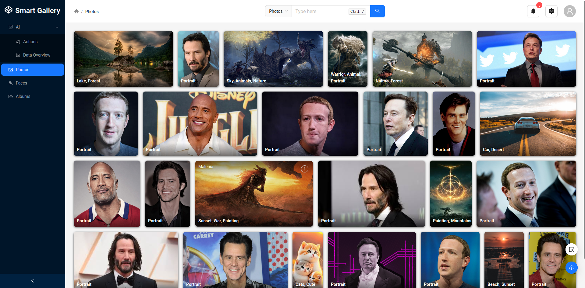
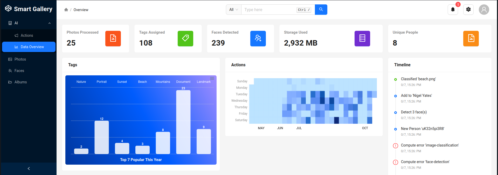
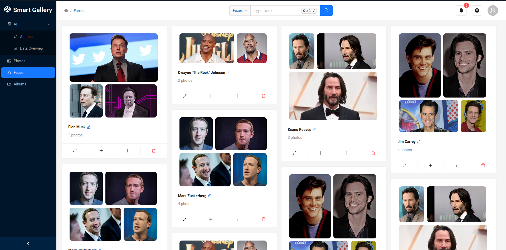
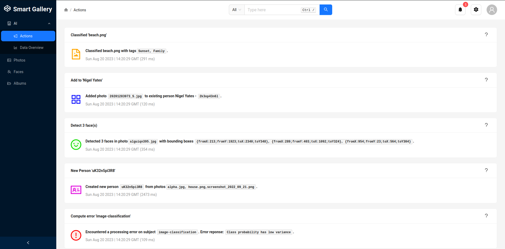
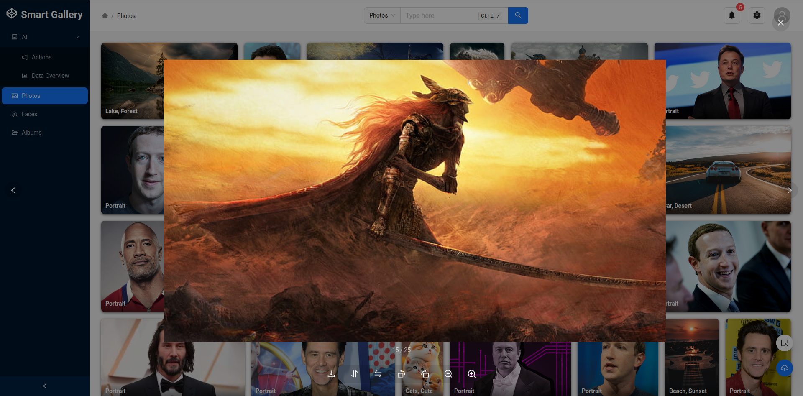
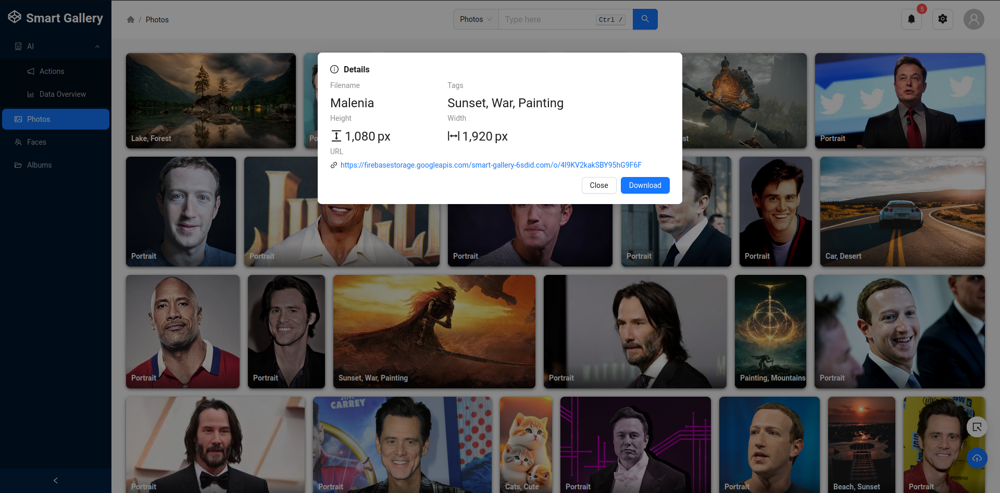

<h1 align="center">Smart Gallery</h1>

<p align="center">
An AI powered gallery web app to conveniently organize your photos.
</p>
<p align="center">
A React app for my <a href="https://github.com/Antony90/ml-photo-api/">Machine Learning based image REST API</a>.
</p>

---

### Machine Learning features:

- **Image classification and tagging** - Search for images in natural language descriptions.
- **Face detection and similarity** - Uploaded photos are grouped by similar faces and visualized with face bounding boxes.

### Photo Gallery features:
- **Create Smart Photo Albums** - Select photos or use automatically generated albums based on tags, faces or date uploaded.
- **Graphs and Statistics** - Image tag distribution, face data
- **Cloud storage** - Firebase storage
- **Masonry Gallery layout** - A natural tiling layout for photos
- **Filtering by metadata** - Any photo metadata

### TODO features:
- Use face bounding boxes for a "generate collage" tool
- Simple photo effects button e.g. contrast, shadow, brightness, filters  

---


### Screenshots
<table>
    <tr>
        <td>Photos</td>
        <td>ML Data Overview</td>
    </tr>
    <tr>
        <td></td>
        <td></td>
    </tr>
    <tr>
        <td>Face ID</td>
        <td>ML Action History</td>
    </tr>
    <tr>
        <td></td>
        <td></td>
    </tr>
    <tr>
        <td>Photo Preview</td>
        <td>Photo Details</td>
    </tr>
    <tr>
        <td></td>
        <td></td>
    </tr>

    
</table>


### Frontend tech

- ant.design - React UI library
- React ApexCharts.js, `ant-design/charts` - Beautiful graphs and charts
- Redux - UI state management
- firebase - database and image storage

### Backend (image classifier, face detection, face data storage)

A REST server hosting an image classification endpoint and face simlarity microservice which stores facial data to group images by unique faces.

Source code and installation [here](https://github.com/Antony90/image-scene-classifier/).

- MongoDB - face embedding data & metadata
- dlib - face recognition
- FastAPI - REST server with automatic documentation


### Demo

~~A static demo is hosted [here](https://antony90.github.io/smart-gallery)~~ To be added soon.


## Usage

### Installation
Requires `nodejs` and `python3` (for backend). A firebase app and mongodb database is required.

```npm install```

### Run local

Start the http server.

```npm run start```

Also start the [backend](https://github.com/image-scene-classifier). Defaults to port 8000.

### Run without Firebase (local storage)

This repository now includes a local API that stores uploaded images on disk and metadata in `local-api/data/photos.json`.

1. Install dependencies:
```bash
npm install
```
2. Start local photo API (port `5001`):
```bash
npm run local-api
```
3. In another terminal, start frontend:
```bash
npm start
```
4. Start built-in ML backend for classification + face recognition:
```bash
python -m pip install -r ml_backend/requirements.txt
npm run ml-backend
```
5. By default local API expects:
   - `ML_API_BASE_URL=http://127.0.0.1:8000`
   - Configure this env var before starting `npm run local-api` if your ML server runs elsewhere.

### Environment variables

Copy `.env.example` to `.env`.

- `REACT_APP_LOCAL_API_BASE_URL` defaults to `http://127.0.0.1:5001`.
